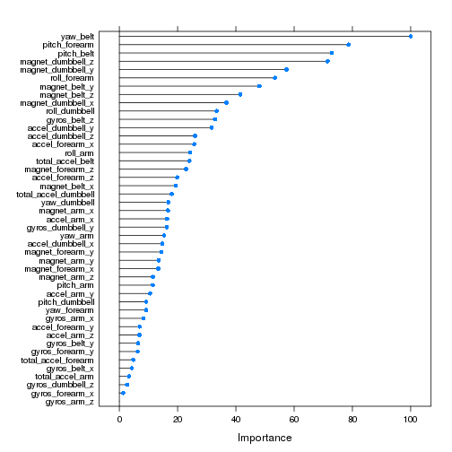

# Introduction

  In this predict, we will use data from accelerometers on the belt,
  forearm, arm, and dumbell of 6 participants. They were asked to
  perform barbell lifts correctly and incorrectly in 5 different
  ways. We will use machine learning algorithms to predict the 5
  different activities.


# Get the raw data

Download the data if necessary, then load the raw data.

```r
pml_training_url <- "https://d396qusza40orc.cloudfront.net/predmachlearn/pml-training.csv"
pml_testing_url <- "https://d396qusza40orc.cloudfront.net/predmachlearn/pml-testing.csv"
pml_training_file <- '../data/pml-training.csv'
pml_testing_file <- '../data/pml-testing.csv'
if( !file.exists(pml_training_file)) {
    download.file(pml_training_url, destfile = pml_training_file, method = "wget")
}
if( !file.exists(pml_testing_file)) {
    download.file(pml_testing_url, destfile = pml_testing_file, method = "wget")
}
raw_data <- read.csv(pml_training_file, header = TRUE, stringsAsFactors = FALSE,
                    na.strings = c("NA", "", "#DIV/0!"))
```

# Preprocess and explore the data

+ *classe* are denoted as *factor*
+ Remove irrelevant features, such as *X*, *user_name*, and etc.
+ Remove features which doesn't have enough variation using *nearZeroVar*
+ Remove featrues which has >95% parts of NA
+ Remove features with high correlations


```r
library(dplyr)
library(caret)
## Remove irrelevant features
processed_data <- raw_data %>%
    dplyr::mutate(classe = factor(classe)) %>%
        dplyr::select(-X, -user_name, -new_window, -num_window,
                      -raw_timestamp_part_1, -raw_timestamp_part_2, -cvtd_timestamp)
## Remove featrues which doesn't have enough variation
nzv_result <- nearZeroVar(processed_data[, sapply(processed_data, is.numeric)], saveMetrics = TRUE)
nzv_column_name <- c(rownames(nzv_result)[nzv_result[, "nzv"] == TRUE])
for (nzv_j in nzv_column_name) {
    processed_data[, nzv_j] <- NULL
}
## Remove columns contains too much NA ( >0.95)
processed_data <- processed_data[, sapply(processed_data, function(x) sum(is.na(x)))
                                <= 0.95 * nrow(processed_data)]
## Remove columns with high correlations
cor_matrx <- cor(processed_data[, sapply(processed_data, is.numeric)])
index_high_cor <- findCorrelation(cor_matrx, cutoff = 0.90)
hcr_column_name <- colnames(cor_matrx)[index_high_cor]
for (hcr_j in hcr_column_name) {
    processed_data[, hcr_j] <- NULL
}
```
# Classfication
## Split into training set and testing set

```r
index_training <- createDataPartition(y = processed_data$classe, p = 0.6, list = FALSE)
training_data <- processed_data[index_training, ]
testing_data <- processed_data[ -index_training, ]
```
## Cross validation
We use repeatedcv to select the best tuning parameters for each model.
To save time, the number of folds and repeats are set to small numbers.

```r
train_control <- trainControl(method = "repeatedcv",
                             number = 3,
                             repeats = 2)
```
## Models
+ random forest
+ boosting: gbm


```r
## boosting model: gbm
gbm_grid <- expand.grid(n.trees = 5, interaction.depth = c(1:5), shrinkage = .1)
gbm_model <- train(classe ~ .,  method = "gbm", data = training_data,
                  trControl = train_control, tuneGrid = gbm_grid, verbose = FALSE)

## random forest
rf_grid <- expand.grid(mtry = 10)
rf_model <- train(classe ~., method = "rf", data = training_data,
                 trControl = train_control, tuneGrid = rf_grid)
```
# Evaluation
In testing data set, the performance of each model is evaluated.
Random forest performs better than gbm.


```r
y_est_gbm <- predict(gbm_model, newdata = testing_data)
y_est_rf <- predict(rf_model, newdata = testing_data)
cm_gbm <- confusionMatrix(y_est_gbm, testing_data$classe)
cm_rf <- confusionMatrix(y_est_rf, testing_data$classe)
as.table(cm_gbm)
```

```
##           Reference
## Prediction    A    B    C    D    E
##          A 1929  190   60   63   44
##          B   88 1079  178   74  162
##          C   50  142 1073  148  149
##          D  161   57   54  895  102
##          E    4   50    3  106  985
```

```r
as.table(cm_rf)
```

```
##           Reference
## Prediction    A    B    C    D    E
##          A 2230    8    0    0    0
##          B    0 1507   19    0    0
##          C    0    2 1346   21    0
##          D    1    0    3 1264    2
##          E    1    1    0    1 1440
```

The expected the out of sample error (testing set) is shown below.

```r
cm_rf$byClass
```

```
##          Sensitivity Specificity Pos Pred Value Neg Pred Value Prevalence
## Class: A   0.9991039   0.9985750      0.9964254      0.9996434  0.2844762
## Class: B   0.9927536   0.9969975      0.9875491      0.9982595  0.1934744
## Class: C   0.9839181   0.9964495      0.9831994      0.9966034  0.1743564
## Class: D   0.9828927   0.9990854      0.9952756      0.9966545  0.1639052
## Class: E   0.9986130   0.9995315      0.9979210      0.9996876  0.1837879
##          Detection Rate Detection Prevalence Balanced Accuracy
## Class: A      0.2842213            0.2852409         0.9988395
## Class: B      0.1920724            0.1944940         0.9948755
## Class: C      0.1715524            0.1744838         0.9901838
## Class: D      0.1611012            0.1618659         0.9909890
## Class: E      0.1835330            0.1839154         0.9990723
```

```r
cm_rf$overall
```

```
##       Accuracy          Kappa  AccuracyLower  AccuracyUpper   AccuracyNull 
##      0.9924802      0.9904870      0.9903106      0.9942708      0.2844762 
## AccuracyPValue  McnemarPValue 
##      0.0000000            NaN
```

Feature importance is shown below.

```r
plot(varImp(rf_model))
```

 

# Results
We use random forest to predict the 20 submitt test case.

```r
raw_data_validation <- read.csv(pml_testing_file, header = TRUE,
                               stringsAsFactors = FALSE, na.strings = c("NA", ""))
predict(rf_model, newdata = raw_data_validation)
```

```
##  [1] B A B A A E D B A A B C B A E E A B B B
## Levels: A B C D E
```
